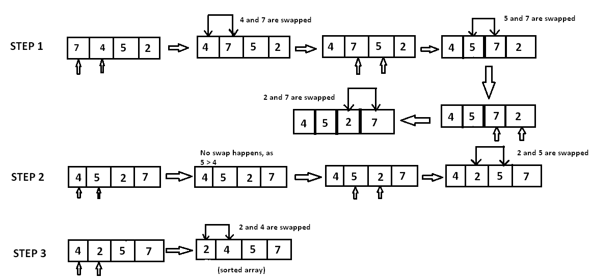

# Bubble Sort

We need the module to create some time difference between each comparison.
```python
import time
```

Import colors from `colors.py`
```python
from colors import *
```

Bubble sort is based on the idea of repeatedly comparing pairs of adjacent elements and then swapping their positions if they exists in the wrong order.
```python
def bubble_sort(data, draw_data, time_tick):
    size = len(data)
    for i in range(size-1):
```

The size of the array-i-1 is for ignoring comparisons of elements that have already been compared in earlier iterations.
```python
        for j in range(size-i-1):
            if data[j] > data[j+1]:
```

Here swapping of positions is being done.
```python
                data[j], data[j+1] = data[j+1], data[j]
```

Draw the data being compared and the finalized.
```python
                draw_data(data, [YELLOW if x == j or x == j+1 else BLUE for x in range(len(data))])
                time.sleep(time_tick)
    draw_data(data, [BLUE for x in range(len(data))])
```

Lets try to understand the pseudo code with an example A = {7, 4, 5, 2}.

<p align="center">
    
</p>

In step 1, 7 is compared with 4, Since 7 > 4, 7 is moved ahead of 4. Since all the other elements are of a lesser value than 7, 7 is moved to the end of the array. 

Now the array is A = {4, 5, 2, 7}

In step 2, 4 is compared with 5. Since 5 > 4 and both 4 and 5 are in ascending order, these elements are not swapped. However, when 5 is compared with 2, 5 > 2 these elements are in descending order. Therefore, 5 and 3 are swapped. 

Now the array is A = {4, 2, 5, 7}. 

In step 3, element 4 is compared with 2. Since 4 > 2 and the elements are in descending order, 4 and 2 are swapped. 

The sorted array is A = {2, 4, 5, 7}. 