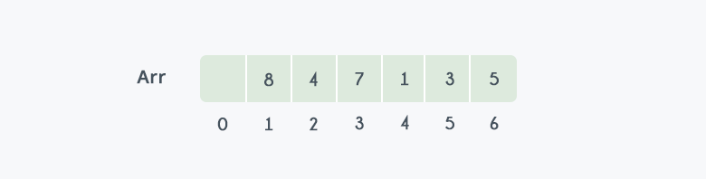
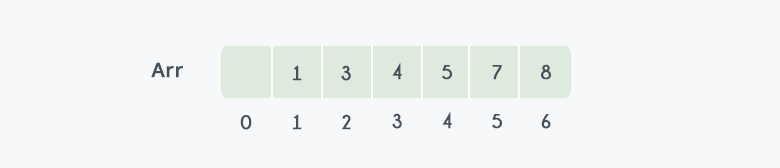

# Heap Sort

Heaps can be used in sorting an array. In max-heaps, the maximum element will always be at the root. Heap Sort uses this property of heap to sort the array.

Consider an array `arr[]` which is to be sorted using Heap Sort.

- Initially build a max heap of elements in `arr[]`.
- The root element, `arr[1]`, will contain the maximum element of `arr[]`. After that, swap this element with the last element of `arr[]` and heapify the max heap excluding the last element which is already in its correct position and then decrease the length of the heap by one.
- Repeat step 2, until all the elements are in their correct position.

## Implementation

To heapify subtree rooted at index, i. n is the size of the heap.

```python
def heapify(data, n, i, draw_data, time_tick):
```

Initialize largest as root.

```python
    largest = i
    left = 2*i + 1
    right = 2*i + 2
```

See if the left child of root exists and is greater than the root.

```python
    if left < n and data[i] < data[left]:
        largest = left
```

See if the right child of root exists and is greater than the root.

```python
    if right < n and data[largest] < data[right]:
        largest = right
```

Change root, if needed

```python
    if largest != i:
        data[i], data[largest] = data[largest], data[i]
```

Heapify the root.

```python
        heapify(data, n, largest, draw_data, time_tick)
```

The main function to sort an array of a given size.

```python
def heap_sort(data, draw_data, time_tick):
    n = len(data)
```

Build a maxheap. Since the last parent will be at ((n//2)-1) we can start at that location.

```python
    for i in range(n-1, -1, -1):
        heapify(data, n, i, draw_data, time_tick)
```

One by one extract elements.

```python
    for i in range(n-1, 0, -1):
        data[i], data[0] = data[0], data[i]
        heapify(data, i, 0, draw_data, time_tick)
```

Draw the data being compared and finalized.

```python
        draw_data(data, [YELLOW if x == i else BLUE for x in range(n)])
        time.sleep(time_tick)
    draw_data(data, [BLUE for x in range(len(data))])
```

## Example

In the diagram below, initially, there is an unsorted array `arr[]` having 6 elements and then max-heap will be built.

<p align="center">
    
</p>

After building max-heap, the elements in the array `arr[]` will be:

<p align="center">
    
</p>

- *Step 1:* 8 is swapped with 5.
- *Step 2:* 8 is disconnected from the heap as 8 is the incorrect position now and.
- *Step 3:* Max-heap is created and 7 is swapped with 3.
- *Step 4:* 7 is disconnected from the heap.
- *Step 5:* Max heap is created and 5 is swapped with 1.
- *Step 6:* 5 is disconnected from the heap.
- *Step 7:* Max heap is created and 4 is swapped with 3.
- *Step 8:* 4 is disconnected from the heap.
- *Step 9:* Max heap is created and 3 is swapped with 1.
- *Step 10:* 3 is disconnected.

<p align="center">
    
</p>

After all the steps, we will get a sorted array.

<p align="center">
    
</p>