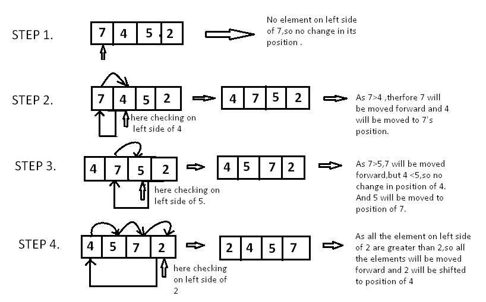

# Insertion Sort

Insertion sort is based on the idea that one element from the input elements is consumed in each iteration to find its correct position i.e, the position to which it belongs in a sorted array. 

It iterates the input elements by growing the sorted array at each iteration. It compares the current element with the largest value in the sorted array. If the current element is greater, then it leaves the element in its place and moves on to the next element else it finds its correct position in the sorted array and moves it to that position. This is done by shifting all the elements, which are larger than the current element, in the sorted array to one position ahead. 

Take array A = [7, 4, 5, 2]

<p align="center">
    
</p>

Since 7 is the first element has no other element to be compared with, it remains at its position. Now when moving towards 4, 7 is the largest element in the sorted list and greater than 4. So, move 4 to its correct position i.e. before 7. Similarly with 5, as 7 (largest element in the sorted list) is greater than 5, we will move 5 to its correct position. Finally, for 2, all the elements on the left side of 2 (sorted list) are moved one position forward as all are greater than 2 and then 2 is placed in the first position. Finally, the given array will result in a sorted array. 

```python
def insertion_sort(data, draw_data, time_tick):
```

Storing current element whose left side is checked for its correct position.
```python
    for i in range(len(data)):
        temp = data[i]
        j = i
```

Check whether the adjacent element on the left side is greater or less than the current element.
```python
        while j > 0 and temp < data[j-1]:
```

Moving the left side element to one position forward.
```python
            data[j] = data[j-1]
            j -= 1
```

Moving current element to its correct position.
```python
        data[j] = temp
```

Draw the data being compared and the finalized.
```python
        draw_data(data, [LIGHT_GREEN if x == j or x == i else BLUE for x in range(len(data))])
        time.sleep(time_tick)
    draw_data(data, [BLUE for x in range(len(data))])
```