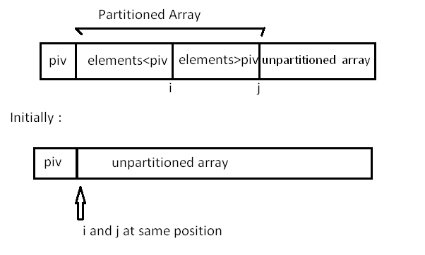

# Quick Sort

Quick Sort is based on the divide-and-conquer approach based on the idea of choosing one element as a pivot element and partitioning the array around it such that: Lefts side of the pivot contains all the elements that are less than the pivot element, the right side contains all elements greater than the pivot.

It reduces the space complexity and removes the use of the auxiliary array that is used in merge sort. Selecting a random pivot in an array result in an improved time complexity in most of the cases. 

Select the first element of an array as the pivot element. First, we will see how the partition of the array takes place around the pivot.

<p align="center">
    
</p>

In the implementation below, the following components have been used: Here, data = array whose elements are to be sorted. 

- *start*: Leftmost position of the array
- *end*: Rightmost position of the array
- *i*: Boundary between the elements that are less than the pivot and those greater than the pivot
- *j*: Boundary between the partitioned and unpartitioned part of the array.
- *pivot*: Pivot element

```python
def partition(data, start, end, draw_data, time_tick):
    i = start + 1
```

Make the first element as pivot element
```python
    pivot = data[start]
    for j in range(start+1, end+1):
```

Rearrange the array by putting elements which are lesser than pivot on one side and which are greater that on other.
```python
        if data[j] < pivot:
            data[i], data[j] = data[j], data[i]
            i += 1
```

Put the pivot element in its proper place.
```python
    data[start], data[i-1] = data[i-1], data[start]
```

Return the position of the pivot
```python
    return i - 1
```

Now, let us see the recursive function `quick_sort()`:

```python
def quick_sort(data, start, end, draw_data, time_tick):
    if start < end:
```

Stores the position of pivot element.
```python
        pivot_position = partition(data, start, end, draw_data, time_tick)
```

Sorts the left side of pivot.
```python
        quick_sort(data, start, pivot_position-1, draw_data, time_tick)
```

Sorts the right side of pivot.
```python
        quick_sort(data, pivot_position+1, end, draw_data, time_tick)
```

Draw the data being compared and the finalized.
```python
        draw_data(data, [PURPLE if x >= start and x < pivot_position else YELLOW if x ==
                            pivot_position else DARK_BLUE if x > pivot_position and x <= end else BLUE for x in range(len(data))])
        time.sleep(time_tick)
    draw_data(data, [BLUE for x in range(len(data))])
```

Here we find the proper position of the pivot element by rearranging the array using partition function. Then we divide the array into two halves left side of the pivot (elements less than pivot element) and right side of the pivot (elements greater than pivot element) and apply the same step recursively.

You have an array A = [9, 7, 8, 3, 2, 1]. Observe in the diagram below, that the `rand_partition()` function chooses pivot randomly as 7 and then swaps it with the first element of the array, and then the `partition()` function takes place, which divides the array into two halves. The first half has elements less than 7 and the other half has elements greater than 7.

For elements less than 7, in the 5th call, the `rand_partition()` function chooses 2 as pivot element randomly and then swaps it with the first element and calls to the `partition()` function takes place. After the 7th and 8th call, no further call can occur as only one element is left in both the calls. Similarly, you can observe the order of calls for the elements greater than 7. 

<p align="center">
    
</p>

Let's see the randomized version of the partition function:

```python
import random 
def rand_partition(data, start, end, draw_data, time_tick):
```

Choose position of pivot randomly by using the `randrange()` function.
```python
    rand = start + random.randrange(end - start + 1)
```

Swap pivot with first element.
```python
    data[rand], data[start] = data[start], data[rand]
```

Call the above partition function.
```python
    return partition(data, start, end, draw_data, time_tick)
```

Use `rand_partition()` instead of the `partition()` function in the `quick_sort()` function to reduce the time complexity of this algorithm.