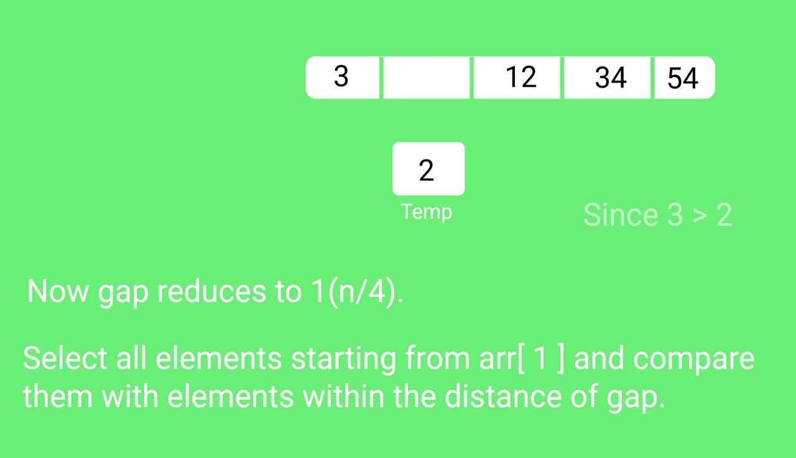

# Shell Sort

Shell Sort is mainly a variation of Insertion Sort. In insertion sort, we move elements only one position ahead. When an element has to be moved far ahead, many movements are involved. The idea of shell sort, we make the array h-sorted for a large value of h. We keep reducing the value of h until it becomes 1. An array is said to be h-sorted if all sublists of every h'th element is sorted.

## Implementation

```python
def shell_sort(data, draw_data, time_tick):
```

Initialize the gap

```python
    gap = len(data) // 2
    while gap > 0:
        i = 0
        j = gap
```

Check the array in from left to right till the last possible index of j.

```python
        while j < len(data):
            if data[i] > data[j]:
                data[i], data[j] = data[j], data[i]
            i += 1
            j += 1
```

Now we cannot move towards left anymore so check the element from last index of i towards to left side of the array.

```python
        while i - gap != -1:
            if data[i - gap] > data[i]:
                data[i - gap], data[i] = data[i], data[i - gap]
            i -= 1
        gap //= 2
```

Draw the data being compared and the finalized.

```python
        draw_data(data, [PURPLE for x in range(len(data))])
        time.sleep(time_tick)
    return draw_data(data, [BLUE for x in range(len(data))])
```

## Example

<p align="center">
    
    
    
    
    
    
</p>