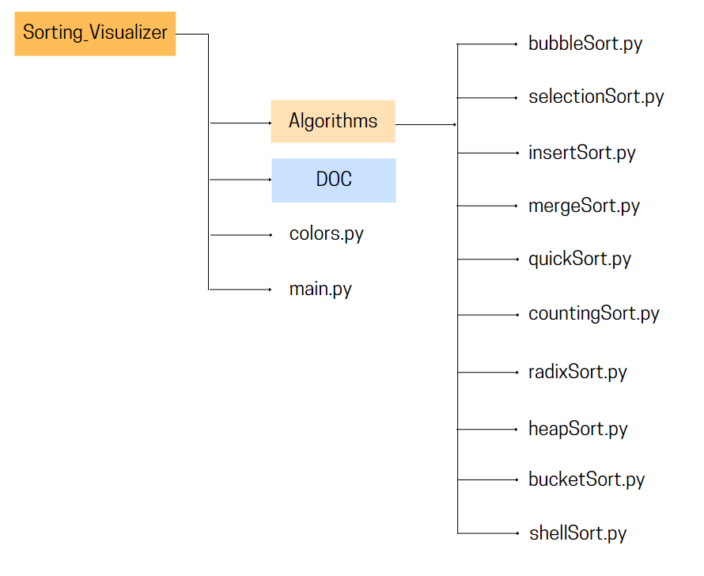

# Sorting Algorithm Visualizer in Python

Original Article: [Sorting Algorithm Visualizer in Python](https://python.plainenglish.io/build-a-sorting-algorithm-visualizer-in-python-f6f4afb1c98a)

In this project, we will a Sorting Algorithm Visualizar using Python and Tkinter. We'll visualize *Bubble Sort* and *Merge Sort*.

## File Structure of the project

<p align="center">
    
</p>

`main.py` will be our main Python file which we will execute. `colors.py` will contain some hexadecimal values of colors that we'll need. The file `__init__.py`, will allow the algorithms folder to act as a Python package. 

## colors.py

In this file, we will store some hexadecimal values of colors as variables. 

```python
DARK_GRAY = '#65696B'
LIGHT_GRAY = '#C4C5BF'
BLUE = '#0CA8F6'
DARK_BLUE = '#4204CC'
WHITE = '#FFFFFF'
BLACK = '#000000'
RED = '#F22810'
YELLOW = '#F7E806'
PINK = '#F50BED'
LIGHT_GREEN = '#05F50E'
PURPLE = '#BF01FB'
```

## main.py

This file will be our main executable file. 

### Interface

First, we will import some stuff and set up a basic interface.

```python
from tkinter import *
from tkinter import ttk

# Importing colors from colors.py that we made earlier
from colors import *

root = Tk()
root.title('Sorting Algorithms Visualization')
root.maxsize(1000, 700)
root.config(bg = WHITE)

root.mainloop()
```

### Variables and Empty Functions

We will need random to create an array
```python
import random
```

Now, we will add some variables and functions. We will edit the functions one by one. For now, we will just `pass`.


*algo_list* is to select which algorithm we want to use to sort
```python
algorithm_name = StringVar()
algorithm_list = ['Bubble Sort', 'Merge Sort', 'Selection Sort', 'Insertion Sort', 'Quick Sort', 'Counting Sort']
```

*speed_list* is for selecting sorting speed
```python
speed_name = StringVar()
speed_list = ['Fast', 'Medium', 'Slow']
```

This empty list will be filled with random values every time we generate a new array 
```python
data = []
```

This function will draw randomly generated list data[] on the canvas as vertical bars
```python
def draw_data(data, colorArray):
    pass
```

This function will generate an array with random values every time we hit the generate button.
```python
def generate():
    pass
```

This function will set the sorting speed
```python
def set_speed():
    pass
```

This function will trigger a selected algorithm and start sorting
```python
def sort():
    pass
```

### User Interface

Now we need few things:

- Two dropdown menus, one to select the algorithm and one to select the sorting speed.

- Two buttons, one to generate the array and one to start sorting.

- A canvas to draw the array.

Let's add some code in the section of the *user interface*

```python
UI_frame = Frame(root, width=900, height=300, bg=WHITE)
UI_frame.grid(row=0, column=0, padx=10, pady=5)
```

Dropdown to select sorting algorithm
```python
l1 = Label(UI_frame, text='Algorithm: ', bg=WHITE)
l1.grid(row=0, column=0, padx=10, pady=5, sticky=W)
algorithm_menu = ttk.Combobox(UI_frame, textvariable=algorithm_name, values=algorithm_list)
algorithm_menu.grid(row=0, column=1, padx=5, pady=5)
algorithm_menu.current(0)
```

Dropdown to select sorting speed
```python
l2 = Label(UI_frame, text='Sorting Speed: ', bg=WHITE)
l2.grid(row=1, column=0, padx=10, pady=5, sticky=W)
speed_menu = ttk.Combobox(UI_frame, textvariable=speed_name, values=speed_list)
speed_menu.grid(row=1, column=1, padx=5, pady=5)
speed_menu.current(0)
```

Button for generating array
```python
b1 = Button(UI_frame, text='Generate Array', command=generate, bg=LIGHT_GRAY, width=20)
b1.grid(row=2, column=0, padx=5, pady=5)
```

Sort button
```python
b2 = Button(UI_frame, text='Sort', command=sort, bg=LIGHT_GRAY, width=20)
b2.grid(row=2, column= 1, padx=5, pady=5)
```

Canvas to draw our array
```python
canvas = Canvas(root, width=800, height=400, bg=WHITE)
canvas.grid(row=1, column=0, padx=10, pady=5)
```

### Filling up the Functions

Now it's time to fill up the functions that we left empty before.

#### `draw_data()`

This function will convert the elements of `data[]` into vertical bars and draw them into the window. 

```python
def draw_data(data, colorArray):
    canvas.delete('all')
    canvas_width = 800
    canvas_height = 400
    x_width = canvas_width / (len(data) + 1)
    offset = 4
    spacing = 2
    normalizedData = [i / max(data) for i in data]
    for i, height in enumerate(normalizedData):
        x0 = i * x_width + offset + spacing
        y0 = canvas_height - height * 390
        x1 = (i + 1) * x_width + offset
        y1 = canvas_height
        canvas.create_rectangle(x0, y0, x1, y1, fill=colorArray[i])
    root.update_idletasks()
```

#### `generate()`

The `generate()` function which will create an array with random values with the help of random module. After creating the array we will store them in data[]. Then we will call the `draw_data()` function from this function.

```python
def generate():
    global data
    data = []
    for i in range(0, 100):
        random_value = random.randint(1, 150)
        data.append(random_value)
    draw_data(data, [BLUE for x in range(len(data))])
```

#### `set_speed()`

This function will determine how fast or slow we want to see the sorting comparisons.

```python
def set_speed():
    if speed_menu.get() == 'Slow':
        return 0.3
    elif speed_menu.get() == 'Medium':
        return 0.1
    else:
        return 0.001
```

#### `sort()`

We will import the algorithms in `main.py`. 

```python
from algorithms.bubbleSort import bubble_sort
from algorithms.mergeSort import merge_sort
from algorithms.selectionSort import selection_sort
from algorithms.insertionSort import insertion_sort
from algorithms.quickSort import quick_sort
from algorithms.countingSort import counting_sort
```

```python
def sort():
    global data
    time_tick = set_speed()
    if algorithm_menu.get() == 'Bubble Sort':
        bubble_sort(data, draw_data, time_tick)
    elif algorithm_menu.get() == 'Merge Sort':
        merge_sort(data, 0, len(data)-1, draw_data, time_tick)
    elif algorithm_menu.get() == 'Selection Sort':
        selection_sort(data, draw_data, time_tick)
    elif algorithm_menu.get() == 'Insertion Sort':
        insertion_sort(data, draw_data, time_tick)
    elif algorithm_menu.get() == 'Quick Sort':
        quick_sort(data, 0, len(data)-1, draw_data, time_tick)
    elif algorithm_menu.get() == 'Counting Sort':
        counting_sort(data, draw_data, time_tick)
    else: 
        pass
```

## References:

Shadhin, F. (2021, 21 junio). Build a Sorting Algorithm Visualizer in Python - Python in Plain English. Medium. https://python.plainenglish.io/build-a-sorting-algorithm-visualizer-in-python-f6f4afb1c98a

Bubble Sort Tutorials & Notes | Algorithms. (2016, 27 abril). HackerEarth. https://www.hackerearth.com/practice/algorithms/sorting/bubble-sort/tutorial/

Merge Sort Tutorials & Notes | Algorithms. (2016, 27 abril). HackerEarth. https://www.hackerearth.com/practice/algorithms/sorting/merge-sort/tutorial/

Selection Sort Tutorials & Notes | Algorithms. (2016, 27 abril). HackerEarth. https://www.hackerearth.com/practice/algorithms/sorting/selection-sort/tutorial/

Insertion Sort Tutorials & Notes | Algorithms. (2016, 27 abril). HackerEarth. https://www.hackerearth.com/practice/algorithms/sorting/insertion-sort/tutorial/

Quick Sort Tutorials & Notes | Algorithms. (2016, 27 abril). HackerEarth. https://www.hackerearth.com/practice/algorithms/sorting/quick-sort/tutorial/

Counting Sort Tutorials & Notes | Algorithms. (2016, 27 abril). HackerEarth. https://www.hackerearth.com/practice/algorithms/sorting/counting-sort/tutorial/